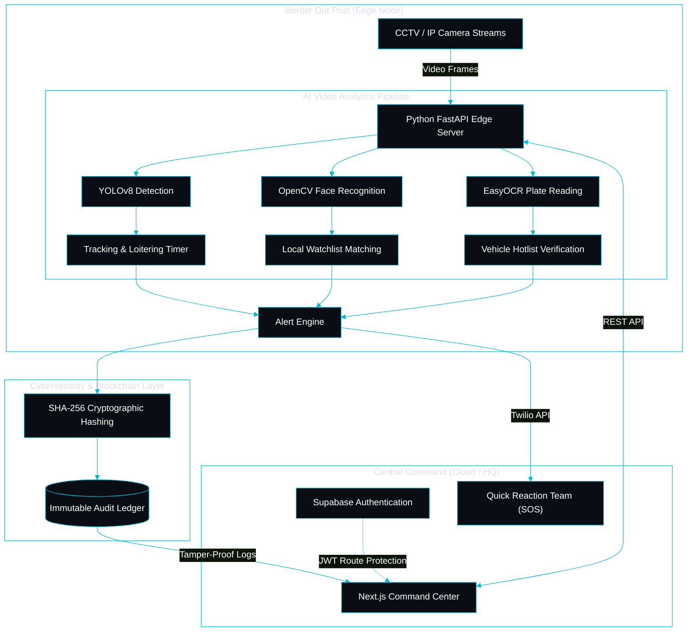
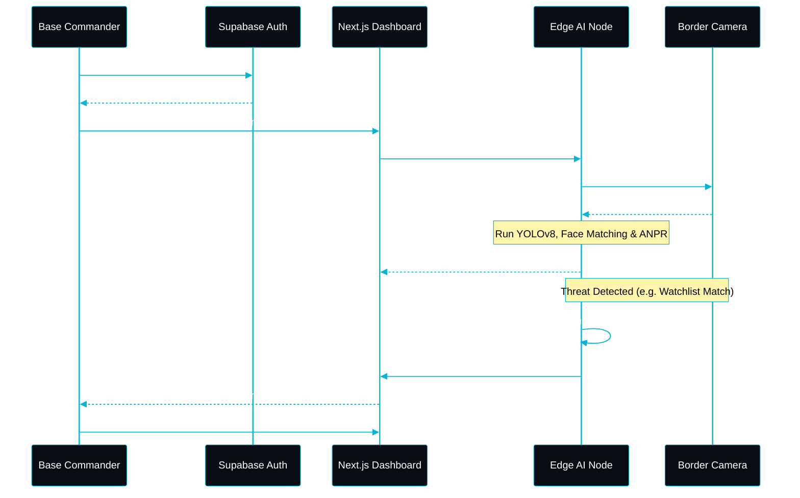

<div align="center">
  <a href="https://github.com/sharvarianand/TRINETRA">
    
  </a>
  <h1 style="border-bottom: none; margin-bottom: 0; margin-top: 10px;"><b>T R I N E T R A</b></h1>
  <p style="margin-top: 0;">
    <b>Intelligent Border Video Analytics Platform</b><br />
    <i>Developed for the Ministry of Home Affairs, Sashastra Seema Bal (SSB), Police II Division</i>
  </p>
  <p>
    
    
    
  </p>
</div>

## 📖 Background

Border security forces deploy CCTV cameras at Border Out Posts (BOPs), check posts, border roads, and other strategic locations for surveillance and monitoring. However, conventional CCTV systems primarily provide video recording and live monitoring capabilities, requiring continuous human observation. 

Advanced surveillance functionalities such as Facial Recognition Systems (FRS), Automatic Number Plate Recognition (ANPR), intrusion detection, and object tracking often require specialized hardware and proprietary solutions, making large-scale deployment costly and difficult, particularly in remote border areas.

## 💡 The Solution

**TRINETRA** is an AI-driven software platform capable of transforming existing CCTV infrastructure into an intelligent surveillance network without requiring dedicated FRS, ANPR, or smart-camera hardware. 

The platform ingests live video streams from standard IP-based CCTV cameras and performs real-time video analytics using Artificial Intelligence and Computer Vision techniques at the Edge.

### Core Capabilities
- 👤 **Human Detection & Tracking**: Real-time identification and persistent tracking across frames.
- 🚙 **Vehicle Detection & Classification**: Differentiate between civilian, military, and transport vehicles.
- 👥 **Face Watchlist Matching**: Compares detected faces against a local database using histogram correlations to identify known suspects.
- 🔢 **ANPR Hotlist System**: Extracts vehicle registration plates and flags stolen/wanted vehicles instantly.
- 🚧 **Virtual Fence Intrusion Detection**: Draw digital boundaries that trigger alerts upon breach.
- ⏱️ **Loitering & Suspicious Activity**: Tracks object dwell-time and triggers alerts if subjects remain in restricted areas for >15 seconds.
- 🌙 **Night-Time Vision Enhancement**: Automatically applies CLAHE (Contrast Limited Adaptive Histogram Equalization) during night hours for low-light conditions.
- ⚡ **Real-Time Alerts & Event Logging**: Instant tactical alerts pushed to the Command Center via WebSocket and WhatsApp.

---

## 🔥 The "X-Factor" Features

To ensure maximum security and reliability in harsh border environments, TRINETRA includes three standout features:

1. **Blockchain Immutable Audit Logs (Cybersecurity Theme)**
   All critical alerts (Intrusions, ANPR hits, Watchlist Matches) are cryptographically hashed using SHA-256 and chained to previous events. This ensures that logs cannot be tampered with, deleted, or altered by corrupt insiders, creating a verifiable and immutable audit trail.

2. **Edge-to-Cloud Architecture (Zero-Internet Capability)**
   BOPs often have poor internet connectivity. TRINETRA processes the heavy AI video analytics locally at the Edge (using JSON flat-files and local image assets) and only transmits lightweight metadata to the central Supabase PostgreSQL cluster when a connection is available.

3. **Military-Grade Tactical UI**
   A specialized dark-mode Command Center dashboard utilizing cyan/red color coding, reducing eye strain for night-shift operators while highlighting high-priority threats immediately.

---

## 🏗️ System Architecture



## 🔄 User & Data Flow



---

## 💻 Technical Architecture & Stack

### Edge AI Analytics (Backend)
- **Core Engine:** Python 3.13, FastAPI, Uvicorn
- **Computer Vision:** Ultralytics YOLOv8 (Tracking & Detection), OpenCV, PyTorch
- **OCR Engine:** EasyOCR (for ANPR / License Plate reading)
- **Face Recognition:** Local Histogram Correlation algorithms for offline watchlist matching
- **Communication:** WebSockets, Twilio API (SOS WhatsApp/SMS Alerts)

### Command Center (Frontend)
- **Framework:** Next.js 14 (App Router), React 18
- **Styling:** Tailwind CSS (Custom Military Tactical Theme)
- **Icons & UI:** Lucide React, Radix UI primitives

### Cybersecurity & Blockchain (Hackathon Theme)
- **Authentication:** Supabase Auth (Email/Password & OTP)
- **Route Protection:** Next.js Edge Middleware with JWT verification
- **Data Security:** AES-256 encrypted session cookies and environment-level isolation
- **Blockchain Ledger:** Cryptographic SHA-256 Hash Chaining. Every incident alert is uniquely hashed with the previous event's signature, creating a tamper-evident, immutable audit trail that prevents log manipulation by internal or external threats.

---

## 🚀 Setup & Installation

### 1. Edge AI Node (Python Backend)
Ensure you have Python 3.13+ installed.

```bash
cd python-server
python -m venv venv
.\venv\Scripts\activate  # Windows
# source venv/bin/activate # Linux/Mac
pip install -r requirements.txt
python -m uvicorn yolo_bounding_boxes:app --host 0.0.0.0 --port 8000
```

### 2. Central Command (Next.js Frontend)
Ensure you have Node.js 18+ installed.

```bash
npm install
npm run dev
```
The Command Center will be available at `http://localhost:3001`.

---


